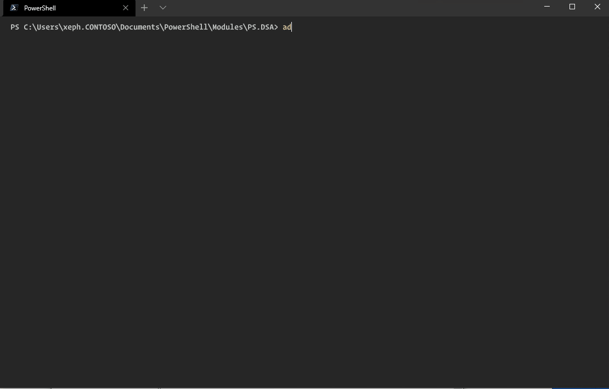

# :busts_in_silhouette:PS.DSA

PS.DSA est un module Powershell, offrant une interface en CLI visant à remplacer la mmc Active Directory pour les besoins basiques

### Fonctions

- Auto-actualisation

- Menu dynamique

  

### TO-DO

- [ ] Gestion des **groups**
- [ ] Gestion des **computers **
- [ ] code cleanup
- [ ] Authentification (need runas for now)
- [ ] :question: Supprimer la dépendance avec le module Active Directory 

